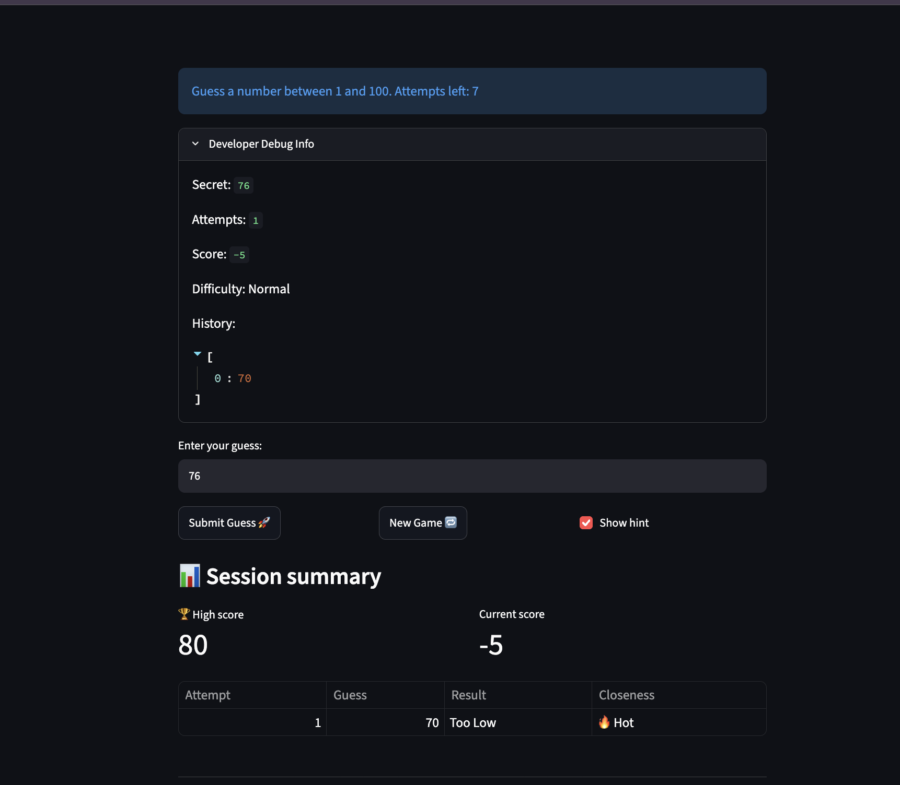
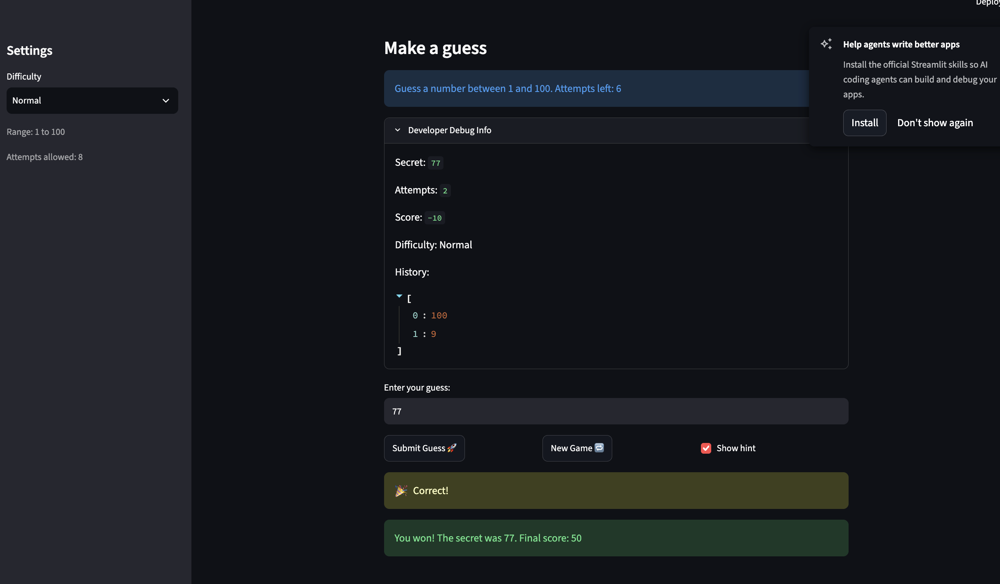
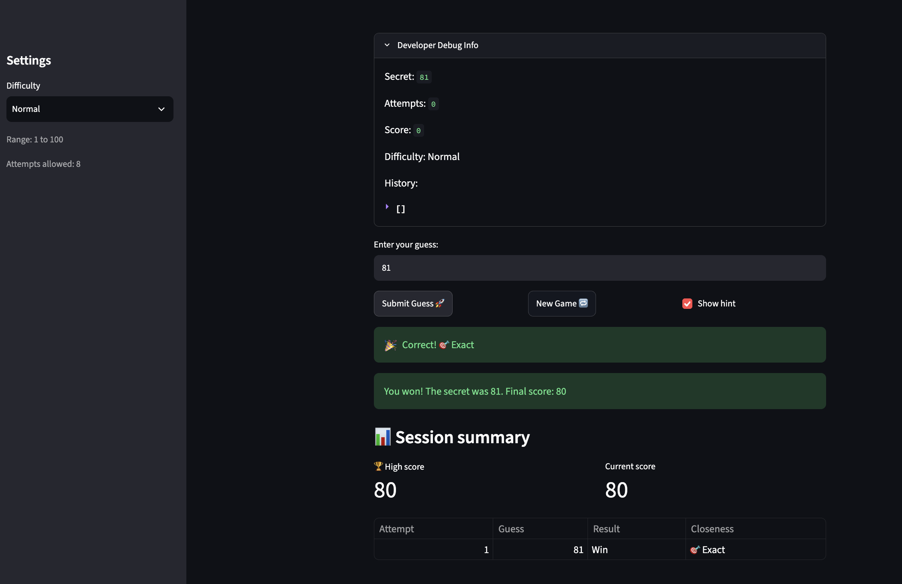
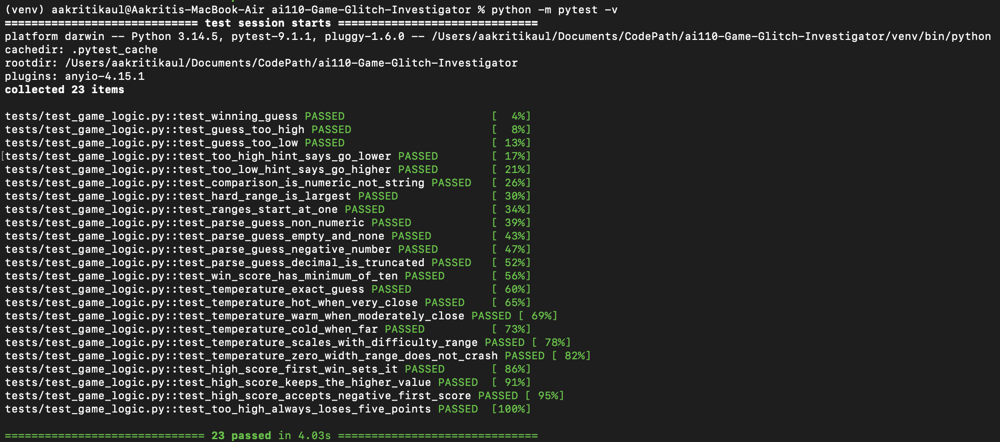
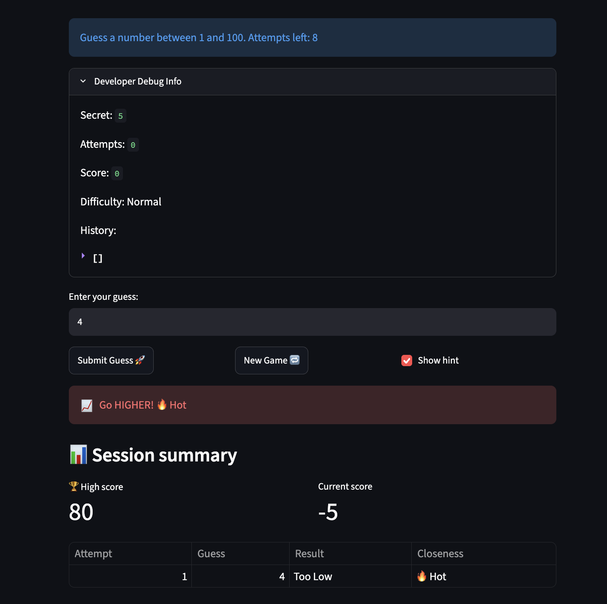
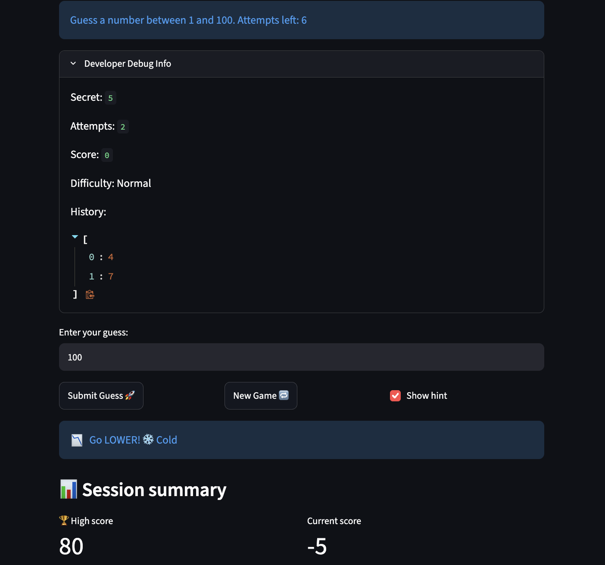

# 🎮 Game Glitch Investigator: The Impossible Guesser

## 🎯 Purpose

This is a Streamlit number-guessing game that an AI originally wrote with several hidden bugs: the hints lied, the difficulty levels were wrong, and the game could get stuck. I found the bugs, fixed them with an AI assistant (Claude), moved the game logic into `logic_utils.py`, and wrote pytest tests to prove the fixes work.

## 🛠️ Setup

1. Install dependencies: `pip install -r requirements.txt`
2. Run the app: `python -m streamlit run app.py`
3. Run the tests: `python -m pytest -v`

## 🐞 Bugs I Found

| # | Bug | Where | Cause |
|---|-----|-------|-------|
| 1 | Hints were backwards ("Too High" told me to go HIGHER) | `check_guess` | The hint messages were swapped |
| 2 | Hard mode was easier than Normal (1–50 vs 1–100) | `get_range_for_difficulty` | Wrong upper bound for Hard |
| 3 | Every other guess could give the wrong hint | `app.py` submit block and `check_guess` | The secret was converted to a string on even attempts, so numbers were compared alphabetically (`"9" > "50"`) |
| 4 | New Game didn't unlock a finished game and ignored the difficulty | `app.py` New Game block | `status`, `score`, and `history` were not reset, and the secret was always `randint(1, 100)` |
| 5 | "Attempts left" was off by one and the prompt always said "1 and 100" | `app.py` | `attempts` started at 1, and the range text was hard-coded |
| 6 | A wrong "Too High" guess sometimes added 5 points to my score | `update_score` | The "Too High" branch gave +5 on even-numbered attempts and −5 on odd ones |

## 🔧 Fixes I Applied

1. **Hints:** I swapped the messages in `check_guess` so a guess that is too high says "Go LOWER!" and a guess that is too low says "Go HIGHER!".
2. **Difficulty:** Hard is now 1–200 (Easy is 1–30, Normal is 1–100), so Easy < Normal < Hard.
3. **String secret:** I removed the string conversion in `app.py` and the `except TypeError` fallback in `check_guess`, so comparisons are always numeric.
4. **New Game:** it now resets attempts, score, status, and history, and picks a new secret from the selected difficulty's range.
5. **Attempts and prompt:** `attempts` now starts at 0, and the prompt shows the real range for the selected difficulty.
6. **Scoring:** a "Too High" guess now always costs 5 points, the same as "Too Low". I found this from my own screenshots, where my score went from -5 up to 0 after a wrong guess.
7. **Refactor:** `get_range_for_difficulty`, `parse_guess`, `check_guess`, and `update_score` now live in `logic_utils.py` with docstrings, and `app.py` imports them.

## 📸 Demo Walkthrough

1. I ran `python -m streamlit run app.py` with **Normal** selected. The sidebar showed "Range: 1 to 100" and "Attempts allowed: 8", and the debug panel showed Secret: 77.
2. I guessed `100` and the game said "📉 Go LOWER!" (before the fix it said higher).
3. I guessed `9` and the game said "📈 Go HIGHER!". This was an even-numbered attempt, which used to give wrong hints.
4. I guessed `77` and got "🎉 Correct!" and "You won! The secret was 77. Final score: 50" (−5, −5, then +60 for winning on attempt 3).
5. I clicked **New Game** and the game unlocked with Attempts: 0, Score: 0, History: [], and a new secret (97).
6. I switched to **Hard** and clicked New Game: "Range: 1 to 200", "Attempts allowed: 5", and the prompt said "between 1 and 200" (secret 120).
7. I switched to **Easy** and clicked New Game: "Range: 1 to 30", "Attempts allowed: 6", and the prompt said "between 1 and 30" (secret 20).

8. After adding the stretch features, I started a new game with the secret at 95 and guessed `95`. The game showed a green "🎉 Correct! 🎯 Exact" message and "You won! The secret was 95. Final score: 80". The new **Session summary** showed High score 80, Current score 80, and a table with one row (Attempt 1, Guess 95, Result Win, Closeness 🎯 Exact).
9. I clicked **New Game**, and the secret changed to 81. I guessed `81` and won again with a score of 80. The session summary showed High score 80 and a table containing only this new game's guess (Attempt 1, Guess 81), so the table had cleared.
10. I clicked **New Game** again (secret 76) and made one wrong guess, `70`. The game showed "Too Low" with a 🔥 Hot closeness, the current score dropped to -5, and the **High score still showed 80** from my earlier win, so the high score is kept across games while the table starts over.



11. I tested the hot/cold hints with the secret at 5. Guessing `4` showed a red "📈 Go HIGHER! 🔥 Hot", guessing `7` showed a red "📉 Go LOWER! 🔥 Hot", and guessing `100` showed a blue "📉 Go LOWER! ❄️ Cold".

**Known limitation:** the "Attempts left" box and the Developer Debug Info panel are drawn before the Submit handler runs, so they show the state from one guess earlier (for example, they still showed 6 attempts left after my third guess). The hints, score, and win/lose logic are correct; only that display lags. I did not fix this.

**Screenshot of my fixed, winning game (secret 77, final score 50):**



**Screenshot of the game with the stretch features (green exact hint, high score, and session summary table):**



## 🧪 Test Results

I wrote 23 pytest tests: the 3 starter tests (updated to unpack the `(outcome, message)` tuple), regression tests for the bugs above (including one for the scoring fix), edge cases for `parse_guess` (non-numeric text, empty and `None` input, negative numbers, and decimals), and tests for the hot/cold hints and the high score tracker.

```
collected 23 items

tests/test_game_logic.py::test_winning_guess PASSED                               [  4%]
tests/test_game_logic.py::test_guess_too_high PASSED                              [  8%]
tests/test_game_logic.py::test_guess_too_low PASSED                               [ 13%]
tests/test_game_logic.py::test_too_high_hint_says_go_lower PASSED                 [ 17%]
tests/test_game_logic.py::test_too_low_hint_says_go_higher PASSED                 [ 21%]
tests/test_game_logic.py::test_comparison_is_numeric_not_string PASSED            [ 26%]
tests/test_game_logic.py::test_hard_range_is_largest PASSED                       [ 30%]
tests/test_game_logic.py::test_ranges_start_at_one PASSED                         [ 34%]
tests/test_game_logic.py::test_parse_guess_non_numeric PASSED                     [ 39%]
tests/test_game_logic.py::test_parse_guess_empty_and_none PASSED                  [ 43%]
tests/test_game_logic.py::test_parse_guess_negative_number PASSED                 [ 47%]
tests/test_game_logic.py::test_parse_guess_decimal_is_truncated PASSED            [ 52%]
tests/test_game_logic.py::test_win_score_has_minimum_of_ten PASSED                [ 56%]
tests/test_game_logic.py::test_temperature_exact_guess PASSED                     [ 60%]
tests/test_game_logic.py::test_temperature_hot_when_very_close PASSED             [ 65%]
tests/test_game_logic.py::test_temperature_warm_when_moderately_close PASSED      [ 69%]
tests/test_game_logic.py::test_temperature_cold_when_far PASSED                   [ 73%]
tests/test_game_logic.py::test_temperature_scales_with_difficulty_range PASSED    [ 78%]
tests/test_game_logic.py::test_temperature_zero_width_range_does_not_crash PASSED [ 82%]
tests/test_game_logic.py::test_high_score_first_win_sets_it PASSED                [ 86%]
tests/test_game_logic.py::test_high_score_keeps_the_higher_value PASSED           [ 91%]
tests/test_game_logic.py::test_high_score_accepts_negative_first_score PASSED     [ 95%]
tests/test_game_logic.py::test_too_high_always_loses_five_points PASSED           [100%]

============================== 23 passed in 4.03s ==============================
```



## 🚀 Stretch Features

**Advanced edge-case testing:** my pytest suite covers non-numeric input, empty and `None` input, negative numbers, decimals, a very late win, and a zero-width range. The terminal output above shows all of them passing. The prompts and my reasoning for each case are in `ai_interactions.md`.

**Feature expansion (High Score tracker):** the game remembers my best winning score for the whole browser session, and it is kept when I click New Game. The logic is `update_high_score` in `logic_utils.py`, and the value is stored in `st.session_state.high_score` in `app.py`. The agent workflow is documented in `ai_interactions.md`.

**Professional documentation and style:** every function in `logic_utils.py` has a docstring describing what it does, its inputs, and what it returns. I ran `python -m flake8 app.py logic_utils.py tests/test_game_logic.py` and it reported no style problems. The command, its output, and the one style change I made are in `ai_interactions.md`.

**Enhanced game UI:**

- **Hot/Cold hints:** `get_temperature` in `logic_utils.py` measures how close a guess is as a fraction of the difficulty's range (within 10% is Hot, within 30% is Warm, otherwise Cold). `TEMPERATURE_LABELS` maps each result to an emoji label: 🎯 Exact, 🔥 Hot, 🌤️ Warm, ❄️ Cold.
- **Color-coded hints:** `show_hint_message` in `app.py` shows the hint in green for an exact guess, red for Hot, yellow for Warm, and blue for Cold.
- **Screenshots of the hints:** a red Hot hint (secret 5, guess 4) and a blue Cold hint (secret 5, guess 100):

  

  

- **Session summary:** `render_summary` in `app.py` shows the high score, the current score, and a table with one row per valid guess (attempt, guess, result, and closeness). The table clears on New Game.

**Thorough AI model comparison:** I gave the hint bug in `check_guess` to both Claude and Gemini and compared the two answers in `ai_interactions.md`, including which fix was more Pythonic and which explanation was easier to understand.
