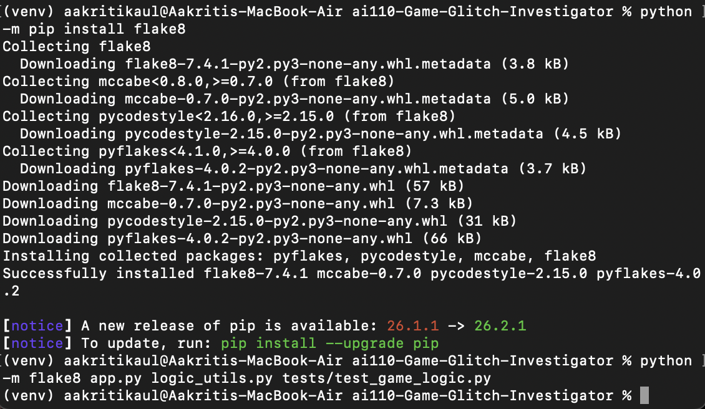
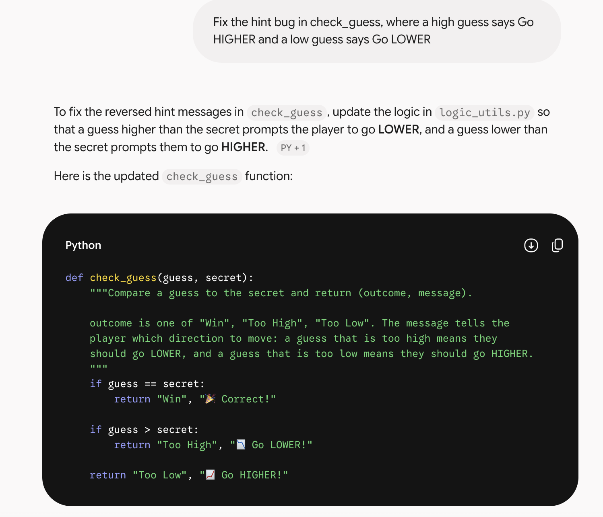
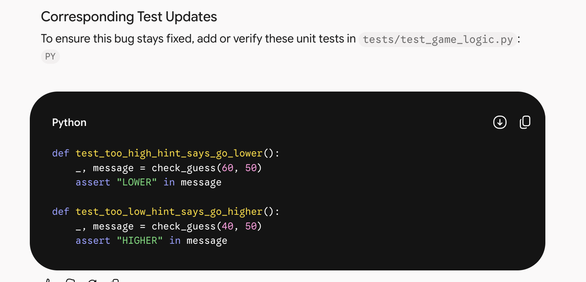

# AI Interactions Log

I used Claude as my only AI tool on this project. This file documents the stretch features I completed.

---

## Agent Workflow (SF8)

**Feature I added:** a High Score tracker that remembers my best winning score for the whole browser session, even across New Game clicks.

**What task did you give the agent?**

I gave Claude this request: *"Can you tell me if we did any stretch features? And if we have not, can you do them?"* Claude identified that the High Score tracker, the hot/cold UI, and the extra tests were not done yet and implemented them. The High Score tracker is the new feature for this section.

**What did the agent do?**

Files modified:

- `logic_utils.py`: added `update_high_score(current_high, new_score)`. It returns the new score when there is no high score yet (including a negative score) and otherwise returns the larger of the two.
- `app.py`: added `st.session_state.high_score` (starts as `None`), updated it with `update_high_score` when the outcome is "Win", and left it out of the New Game reset so it survives between games. It is shown as a "🏆 High score" metric in the new session summary (`render_summary`).
- `tests/test_game_logic.py`: added three tests (`test_high_score_first_win_sets_it`, `test_high_score_keeps_the_higher_value`, `test_high_score_accepts_negative_first_score`).

Claude also ran the tests with a small test runner and used a stand-in for Streamlit to simulate a full game (an invalid guess, a wrong guess, a win, a rerun after the win, then New Game). In that simulation the high score was set to 65 on the win and was still 65 after New Game, while the guess table and attempts reset.

**What did you have to verify or fix manually?**

Claude could not run the real Streamlit app or pytest in its environment, so I verified the feature myself. I ran `python -m pytest -v` and all 22 tests passed at that point; after I later fixed the scoring bug and added one more test, all 23 passed (4.03s). I then ran `streamlit run app.py`, won a game, clicked New Game, and won again: the session summary showed a High score of 80 and a table containing only the new game's guess, so the table cleared on New Game. I then clicked New Game again and made one wrong guess (70, which gave "Too Low" and a current score of -5): the High score still showed 80, which confirms it is kept between games. I also tested the hints with the secret at 5: a guess of 4 and a guess of 7 gave red 🔥 Hot hints, and a guess of 100 gave a blue ❄️ Cold hint. I also reviewed the diff for every file Claude changed. The only corrections during the work were Claude's own: a bug in its first Streamlit stand-in script (not in the app) and one comment longer than 79 characters that it shortened.

---

## Test Generation (SF7)

**Prompt used:** my first message to Claude, which included Step 3 of the lab: *"Ask your AI coding assistant to generate a pytest case that specifically targets the bug you just fixed."* I gave one prompt for all of the tests, and Claude chose the edge cases and explained why each one mattered. For the stretch-feature tests I used the request quoted in the Agent Workflow section above.

| Edge Case | Prompt Used | AI-Suggested Test | Did It Pass? | Your Reasoning |
|-----------|-------------|-------------------|--------------|----------------|
| Non-numeric text | Step 3 prompt above | `test_parse_guess_non_numeric`: `parse_guess("abc")` returns `(False, None, "That is not a number.")` | Yes | Players type letters all the time, so this must not crash the game. |
| Empty and `None` input | Step 3 prompt above | `test_parse_guess_empty_and_none`: `""` and `None` both return `ok == False` | Yes | Pressing Submit with an empty box is the most common input mistake. |
| Negative number | Step 3 prompt above | `test_parse_guess_negative_number`: `"-5"` parses to `-5` | Yes | The minus sign could be mistaken for invalid input, so I wanted to confirm it is accepted as a number. |
| Decimal input | Step 3 prompt above | `test_parse_guess_decimal_is_truncated`: `"42.9"` becomes `42` | Yes | `parse_guess` has a separate code path for `"."`, so it needed its own test. |
| Very late win | Step 3 prompt above | `test_win_score_has_minimum_of_ten`: `update_score(0, "Win", 20)` equals `10` | Yes | The formula `100 - 10 * (attempt + 1)` goes negative, and the code is supposed to cap the points at 10. |
| Zero-width range | Stretch-feature request above | `test_temperature_zero_width_range_does_not_crash`: `get_temperature(3, 5, 5, 5)` returns "Cold" | Yes | If `low == high`, dividing by the range would raise a `ZeroDivisionError`. |
| Hot/cold scales with difficulty | Stretch-feature request above | `test_temperature_scales_with_difficulty_range` | Yes | The same distance should feel different on Easy and Hard, so the thresholds are a fraction of the range. |
| Negative first high score | Stretch-feature request above | `test_high_score_accepts_negative_first_score`: `update_high_score(None, -10)` returns `-10` | Yes | A first win can have a negative score, and a `None` check that treated `0` as "no score" would be wrong. |
| Wrong-guess scoring on every attempt number | I asked Claude to fix the "Too High" scoring in `update_score` and add a test | `test_too_high_always_loses_five_points`: `update_score(10, "Too High", attempt) == 5` for attempts 1 to 4 | Yes | The bug only appeared on even-numbered attempts, so a test with a single attempt number could have missed it. |

---

## Linting & Style (SF9)

**What I used AI for:** Claude wrote a docstring for every function in `logic_utils.py` (`get_range_for_difficulty`, `parse_guess`, `check_guess`, `update_score`, `get_temperature`, and `update_high_score`) and kept the code within PEP 8. Each docstring says what the function does, what it takes, and what it returns.

**Prompt used:**

```
Can you tell me if we did any stretch features? And if we have not, can you do them?
```

After that, Claude asked me to run flake8 myself because it had no linter in its environment.

**Linting output:**

```
(venv) aakritikaul@Aakritis-MacBook-Air ai110-Game-Glitch-Investigator % python -m flake8 app.py logic_utils.py tests/test_game_logic.py
(venv) aakritikaul@Aakritis-MacBook-Air ai110-Game-Glitch-Investigator %
```

flake8 printed nothing, which means it found no style problems in any of the three files.



**Changes applied:**

- Before I ran flake8, Claude checked line lengths itself and found one comment in `logic_utils.py` that was 83 characters long (PEP 8 limit is 79). It split the comment over two lines, and I applied that change.
- Claude suggested no renames. The functions were already `snake_case` and the constant `TEMPERATURE_LABELS` was already `UPPER_CASE`, so I kept the existing names.
- When I first tried to run flake8 I got `command not found: pip`, because I was not inside my virtual environment. I activated it with `source venv/bin/activate` and used `python -m pip install flake8`, which fixed it.

---

## Model Comparison (SF11)

**Task given to both models:** fix the reversed hint bug in `check_guess`, where a guess that is too high tells the player to go higher and a guess that is too low tells them to go lower.

- **Claude:** I gave Claude my project files and the lab instructions in my first message, and it refactored `check_guess` into `logic_utils.py` and fixed the hints as part of that.
- **Gemini:** I gave Gemini this one-sentence prompt: *"Fix the hint bug in check_guess, where a high guess says Go HIGHER and a low guess says Go LOWER"*.

The prompts were not identical, so this is a comparison of the answers each model gave, not a perfectly controlled test.





| | Model A | Model B |
|-|---------|---------|
| **Model name** | Claude | Gemini |
| **Response summary** | Swapped the two hint messages so a too-high guess says "Go LOWER!" and a too-low guess says "Go HIGHER!". It also found a second, related bug: `app.py` turned the secret into a string on even attempts, and `check_guess` had an `except TypeError` branch that compared strings (`"9" > "50"`). It removed both, moved the function into `logic_utils.py`, and added tests for the hint text and for numeric comparison. | Swapped the two hint messages so a too-high guess returns "Go LOWER!" and a too-low guess returns "Go HIGHER!", and wrote a docstring explaining the directions. It then suggested two tests (`test_too_high_hint_says_go_lower` and `test_too_low_hint_says_go_higher`) that check for "LOWER" and "HIGHER" in the message. In the screenshots I have, it did not mention the string-secret problem in `app.py`. |
| **More Pythonic?** | Essentially a tie. The final `check_guess` body is almost the same as Gemini's. Both use early returns and no `else`, and both removed the old nested `try`/`except`. Claude's file has extra `# FIX:` comments for the lab, which make it a little busier. | Essentially a tie. As a standalone function it is slightly cleaner to read because it has no history comments, but the logic is the same as Claude's. |
| **Clearer explanation?** | More complete but longer. It explained the swapped messages and why the string comparison was a second bug. | Easier to understand at a glance. One sentence explained the fix ("a guess higher than the secret prompts the player to go LOWER"), followed by the function and the tests. |

**Which did you prefer and why?**

Gemini's answer was the easier one to understand, because it explained the fix in one short sentence and showed the exact tests to add. I still preferred Claude's answer for this project. Fixing only the swapped messages would have left every second guess wrong, since the string-secret bug in `app.py` was still there, and Claude was the one that found and fixed it. The two functions are so similar that I would not call either one more Pythonic. The real difference was how much of the surrounding code each model looked at.
